<div align="center">



</div>

<br/>

<div align="center">

</div>

<div align="center">

</div>

<br/>

<!-- ================= DIGITAL PASSPORT ================= -->

<h3 align="center">🛂 DIGITAL PASSPORT</h3>
<p align="center"><sub>decrypting operator profile...</sub></p>

<table align="center">
<tr>
<td width="140" align="center">

```
   ╭──────────╮
   │  ◉    ◉  │
   │    ▽     │
   │  ╰────╯  │
   ╰──────────╯
   OPERATOR.ID
```

</td>
<td>

| FIELD | VALUE |
|---|---|
| **CALLSIGN** | Prince Prajapati |
| **GITHUB** | [@princeprajapati7561-cell](https://github.com/princeprajapati7561-cell) |
| **CLASS** | Software Engineer / AI Engineer |
| **SUB-CLASS** | Python Dev · Flutter Dev · QA Engineer |
| **PRIME DIRECTIVE** | Build world-class AI products |
| **CURRENT ORBIT** | Applied ML · Computer Vision · Cross-platform Systems |
| **CLEARANCE** | `LEVEL 5 — SHIP IT` |

</td>
</tr>
</table>

<div align="center">

</div>

<!-- ================= REALITY ENGINE / STACK ================= -->

<h3 align="center">⚙️ REALITY ENGINE // ACTIVE MODULES</h3>

<div align="center">

</div>

<div align="center">

</div>

<!-- ================= NEURAL ENGINE / SKILLS ================= -->

<h3 align="center">🧬 NEURAL ENGINE // CORE PROFICIENCY SCAN</h3>

<div align="center">

</div>

<details>
<summary><b>▸ expand raw skill tree</b></summary>
<br/>

```
core/
├── languages/
│   ├── python          ★★★★★
│   └── dart             ★★★★☆
├── frameworks/
│   ├── flutter          ★★★★☆
│   ├── fastapi           ★★★★☆
│   └── react              ★★★☆☆
├── ai-ml/
│   ├── machine-learning     ★★★★☆
│   └── computer-vision/opencv ★★★★☆
├── infra/
│   ├── firebase          ★★★★☆
│   └── supabase           ★★★☆☆
└── tooling/
    ├── git                ★★★★★
    └── github-workflows    ★★★★★
```

</details>

<div align="center">

</div>

<!-- ================= MISSION CONTROL / PROJECT LAUNCHER ================= -->

<div align="center">

</div>

<br/>

<table width="100%">
<tr>
<td width="33%" valign="top">

### 🛡️ LAUNCH_01
**[`ShieldX`](https://github.com/princeprajapati7561-cell/ShieldX)**
<sub>AI Women Safety App</sub>

> Real-time safety system combining on-device intelligence with rapid emergency response, built to act the moment it matters most.

`STATUS` 

`STACK` Flutter · Firebase · ML

</td>
<td width="33%" valign="top">

### 🧠 LAUNCH_02
**[`AI Reality OS`](https://github.com/princeprajapati7561-cell/AI-Reality-OS)**
<sub>Experimental AI Interface</sub>

> An operating-system-style interface exploring how humans and AI systems should actually talk to each other — this profile is a fragment of it.

`STATUS` 

`STACK` Python · AI/ML · Systems Design

</td>
<td width="33%" valign="top">

### 📊 LAUNCH_03
**[`YouTube Trending AI Analytics`](https://github.com/princeprajapati7561-cell/YouTube-Trending-AI-Analytics)**
<sub>Data Intelligence Engine</sub>

> Pulls and models trending video data to surface patterns humans would take weeks to notice manually.

`STATUS` 

`STACK` Python · FastAPI · Data/ML

</td>
</tr>
</table>

<table width="100%">
<tr>
<td width="100%" valign="top">

### 🔁 LAUNCH_04
**[`Daily GitHub Activity`](https://github.com/princeprajapati7561-cell/Daily-GitHub-Activity)**
<sub>Autonomous Contribution Engine</sub>

> A self-sustaining background process — quietly logging commits, shipping small improvements, and keeping the signal alive every single day.

`STATUS` 

`STACK` Python · GitHub Actions · Automation

</td>
</tr>
</table>

<div align="center">

</div>

<!-- ================= MISSION TIMELINE ================= -->

<h3 align="center">🛰️ MISSION TIMELINE</h3>

<div align="center">

</div>

<div align="center">

</div>

<!-- ================= TERMINAL COMMANDS ================= -->

<h3 align="center">💻 DEVELOPER CONSOLE // TERMINAL COMMANDS</h3>

<div align="center">

</div>

<div align="center">

</div>

<!-- ================= SYSTEM DIAGNOSTICS (LIVE) ================= -->

<h3 align="center">📟 SYSTEM DIAGNOSTICS // LIVE TELEMETRY</h3>

<p align="center">


</p>

<p align="center">

</p>

<p align="center">

</p>

<div align="center">

</div>

<!-- ================= FUTURE PROTOCOL / OUTGOING TRANSMISSION ================= -->

<h3 align="center">📶 FUTURE PROTOCOL // OUTGOING TRANSMISSION</h3>

<p align="center">
<a href="https://github.com/princeprajapati7561-cell"></a>
<a href="#"></a>
<a href="#"></a>
</p>

<div align="center">

</div>
